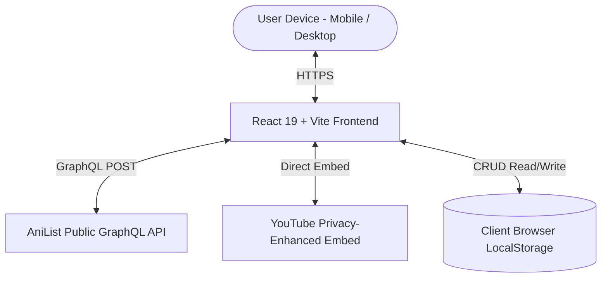

# Product Requirements Document (PRD)

## Project: AnimePulse — Anime Discovery & Streaming Recommendation Platform
**Document Version:** 1.0.0  
**Status:** Active / Production-Ready  
**Date:** September 26, 2026  
**Author:** Product & Engineering Team  

---

## 1. Executive Summary & Vision

AnimePulse is a modern, privacy-first anime discovery and tracking web application. It addresses the common pain point of fragmented anime discovery by aggregating real-time broadcasting schedules, community ratings, character cast profiles, official streaming platform links (Crunchyroll, Netflix, Hulu, Disney+, Amazon Prime Video), and official trailers into a single unified Apple Human Interface-inspired interface.

### Key Objectives
* **Zero-friction discovery:** Deliver real-time catalog search and multi-parameter filtering without requiring user login or account setup.
* **Verified streaming availability:** Direct users to legal, official streaming partners with zero pirate link clutter.
* **Private local tracking:** Provide complete watchlist tracking and episode progress persistence entirely in `localStorage` with JSON export/import portability.
* **Apple UI aesthetics:** Deliver a premium frosted glass design with dynamic material layers, device adaptability, and fluid mobile navigation.

---

## 2. Target Audience & User Personas

1. **Active Anime Streamer ("Kenji"):** Watches 3–5 seasonal shows per week. Needs to know where each show is legitimately streaming (Crunchyroll vs. Netflix vs. Hulu) and when new episodes drop.
2. **Catalog Explorer ("Sophia"):** Looking for critically acclaimed anime by genre (Psychological, Sci-Fi, Slice of Life) with high scores (>80%) from specific production years.
3. **Franchise Follower ("Marcus"):** Needs to understand complex multi-season watch orders, prequels, sequels, and related spin-offs.
4. **Privacy-Conscious User ("Elena"):** Wants to track personal watchlist progress without creating accounts, providing emails, or being subjected to ad tracking.

---

## 3. Technology Stack & System Architecture



* **Core Framework:** React 19 + TypeScript
* **Build Tooling:** Vite 8 (Ultra-fast HMR & optimized production bundling)
* **Styling System:** Tailwind CSS v4 + Apple Human Interface Material Tokens
* **Routing:** React Router DOM (v7)
* **API Client:** AniList GraphQL Endpoint (`https://graphql.anilist.co`)
* **Icons:** Lucide React
* **State & Persistence:** React Context API + LocalStorage (`anime_pulse_watchlist_v1`)

---

## 4. Functional Specifications & Feature Requirements

### 4.1. Home Dashboard (`/`)
* **Hero Spotlight:** Highlights the #1 trending anime with high-resolution banner art, score badges, clean synopsis snippet, and direct "Watch Trailer" trigger.
* **Trending Now Carousel:** Horizontal scroll row of community-trending titles.
* **Airing This Season:** Dynamically calculated seasonal titles based on the current calendar month and year.
* **Top 100 Highest Rated:** All-time critically acclaimed anime sorted by community mean score.
* **All-Time Popular:** Most added/watched titles globally.
* **Upcoming Releases:** Anticipated titles with unreleased status.
* **Genre Category Grid:** Visual cards for top genres leading to filtered discovery.

### 4.2. Discover & Search Engine (`/discover`)
* **Live Keyword Search:** Instant keyword lookup against AniList titles (English, Romaji, and native Japanese).
* **Multi-Filter Combination:**
  * **Genre:** Action, Adventure, Comedy, Drama, Fantasy, Horror, Mystery, Psychological, Romance, Sci-Fi, Slice of Life, Sports, Supernatural, Thriller.
  * **Format:** TV Series, Movie, TV Short, OVA, ONA, Special.
  * **Status:** Airing, Finished, Upcoming, Cancelled.
  * **Season & Year:** Winter, Spring, Summer, Fall across 1990–2026.
  * **Sorting:** Trending, Popularity, Average Score, Release Date, Favourites, Title A–Z.
* **Pagination:** Full page navigation with total count metrics.

### 4.3. Anime Detail View (`/anime/:id`)
* **Header & Artwork:** High-resolution banner backdrop with ambient color spotlight and poster card.
* **Comprehensive Metadata:** Format, Status, Total Episodes, Episode Duration, Broadcast Season, Studio, Source Material, and Hashtag.
* **Verified Streaming Partners:** Direct outlinks with official platform icons (Crunchyroll, Netflix, Hulu, Disney+, Amazon Prime Video, HIDIVE, etc.).
* **Episodes Grid:** Available streaming clips and episode links.
* **Characters & Cast:** Japanese voice actor (Seiyuu) portraits mapped to character roles (Main/Supporting).
* **Franchise Relations:** Prequels, sequels, side stories, and summary relations with quick navigation cards.
* **Community Recommendations:** Algorithmically paired titles.
* **Trailer Modal:** YouTube iframe in privacy-enhanced mode (`youtube-nocookie.com`).

### 4.4. Personal Watchlist & Progress Tracker (`/watchlist`)
* **Status Categories:** Watching, Plan to Watch, Completed, and Favorites.
* **Interactive Counter:** Instant episode increment/decrement buttons (`+` / `-`).
* **Personal Score Rating:** 1–10 star score assignment.
* **Genuine Statistics:** Real counts of total anime tracked, active shows, episodes watched, and user mean score.
* **Data Portability:**
  * **Export:** One-click JSON backup file download.
  * **Import:** Client-side JSON file reader with format validation.
  * **Clear:** Complete local wipe with user confirmation.

### 4.5. Compliance & Legal Pages
* **Privacy Policy (`/privacy`):** Complete disclosure of client-side storage, zero PII collection, and third-party API use.
* **Terms of Service (`/terms`):** Intellectual property attribution, non-commercial fair use declaration, and external streaming provider disclaimers.

---

## 5. Non-Functional Requirements

| Category | Requirement | Standard |
| :--- | :--- | :--- |
| **Performance** | Largest Contentful Paint (LCP) < 1.5s, First Input Delay (FID) < 100ms | 95+ Lighthouse Score |
| **Responsiveness** | Mobile (320px) to Ultra-wide (2560px) fluid scaling | iOS Tab Bar on mobile, top bar on desktop |
| **Accessibility** | WCAG 2.1 AA compliant contrast, aria labels on icon buttons | Validated |
| **Reliability** | AniList GraphQL error catching with retry states | Zero uncaught runtime errors |
| **Security** | Safe YouTube nocookie embeds, no external scripts or trackers | CSP Compliant |

---

## 6. GraphQL Schema & Sample Query

```graphql
query GetAnimeDetails($id: Int) {
  Media(id: $id, type: ANIME) {
    id
    title {
      romaji
      english
      userPreferred
    }
    coverImage {
      extraLarge
      large
      color
    }
    bannerImage
    format
    status
    episodes
    duration
    season
    seasonYear
    averageScore
    genres
    description
    studios(isMain: true) {
      nodes { id name }
    }
    externalLinks {
      id
      url
      site
      icon
    }
    trailer {
      id
      site
    }
    characters(sort: [ROLE, RELEVANCE], perPage: 12) {
      edges {
        role
        node { id name { full } image { large } }
        voiceActors(language: JAPANESE) { id name { full } image { large } }
      }
    }
    relations {
      edges {
        relationType
        node { id title { userPreferred } coverImage { large } format averageScore }
      }
    }
  }
}
```

---

## 7. Future Roadmap

* **v1.1.0:** Custom notification timers for next airing episodes.
* **v1.2.0:** Anilist OAuth 2.0 optional two-way sync for users with existing AniList accounts.
* **v1.3.0:** Offline PWA (Progressive Web App) support for watchlist tracking without internet.
