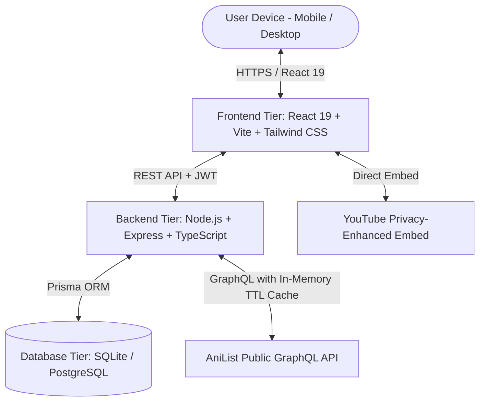

# Product Requirements Document (PRD)

## Project: AnimeSenpai — Anime Discovery, Tracking & Streaming Recommendation Platform
**Document Version:** 2.0.0 (3-Tier Full-Stack Architecture)  
**Status:** Active / Production-Ready  
**Date:** September 26, 2026  
**Author:** Product & Engineering Team  

---

## 1. Executive Summary & Vision

AnimeSenpai is a modern, full-stack anime discovery and tracking web application. It aggregates real-time broadcasting schedules, community ratings, character cast profiles, official legal streaming platform links (Crunchyroll, Netflix, Hulu, Disney+, Amazon Prime Video), and official trailers into a single unified Apple Human Interface-inspired interface.

### Key Objectives
* **Zero-friction discovery:** Deliver real-time catalog search and multi-parameter filtering.
* **Full-Stack Flexibility:** Modular 3-tier architecture separating `frontend`, `backend`, and `database`.
* **Personalized Recommendation Engine:** Algorithmically computes genre and user preference affinity scores.
* **Verified streaming availability:** Direct users to legal, official streaming partners with zero pirate link clutter.
* **Persistent Tracking & Data Portability:** User accounts with SQLite/PostgreSQL database persistence plus JSON export/import.
* **Apple UI aesthetics:** Frosted glass design with dynamic material layers and fluid navigation.

---

## 2. 3-Tier System Architecture

### Tier Breakdown

1. **Frontend (`/frontend`)**
   * **Framework:** React 19 + TypeScript
   * **Build Tooling:** Vite 8
   * **Styling:** Tailwind CSS v4 + Apple Material Design tokens
   * **Routing:** React Router DOM v7
   * **Icons:** Lucide React

2. **Backend (`/backend`)**
   * **Runtime:** Node.js + Express + TypeScript
   * **Security:** JWT Authentication, bcrypt password hashing, CORS
   * **Caching:** In-memory TTL caching for external API queries to prevent rate-limiting
   * **Recommendation Engine:** Content-based similarity and genre-weight analysis

3. **Database (`/database`)**
   * **ORM:** Prisma Client
   * **Default Engine:** SQLite (Zero-configuration embedded local database)
   * **Supported Engine:** PostgreSQL (via included Docker Compose)
   * **Schema Entities:** Users, Watchlist Items, Anime Cache, Reviews, Activity Logs

---

## 3. Functional Specifications

### 3.1. Authentication & Profile Management
* **Credentials & Demo Login:** Register with username/email or 1-click Instant Demo Login.
* **Profile Customization:** Select avatar presets, customize bio, banner, and favorite genres.

### 3.2. Discover & Search Engine (`/discover`)
* **Multi-Filter Combination:** Search keyword, 14 genres, formats (TV, Movie, OVA, etc.), status, season & release year.
* **Sorting Algorithms:** Trending, Popularity, Average Score, Release Date, Favourites.

### 3.3. Anime Detail View (`/anime/:id`)
* **Comprehensive Metadata:** Episodes, duration, broadcast season, studio, synopsis.
* **Verified Streaming Partners:** Direct outlinks to Crunchyroll, Netflix, Hulu, etc.
* **Characters & Cast:** Japanese voice actors mapped to roles.
* **Franchise Relations & Recommendations:** Sequel/prequel trees and related titles.

### 3.4. Personal Watchlist & Progress Tracker (`/watchlist`)
* **Status Categories:** Watching, Plan to Watch, Completed, Favorites, Dropped, Paused.
* **Interactive Counter:** Instant episode progress increments (`+` / `-`).
* **Personal Score Rating:** 1–10 star score assignment.
* **Data Portability:** JSON backup export and import.

### 3.5. Smart Recommendations (`/api/recommendations`)
* **Genre Affinity Calculation:** Weighs user's top-rated and completed titles to recommend matching unseen anime.

---

## 4. Non-Functional Requirements

| Category | Requirement | Standard |
| :--- | :--- | :--- |
| **Performance** | LCP < 1.5s, Server response < 80ms | 95+ Lighthouse Score |
| **Responsiveness** | Mobile (320px) to Ultra-wide (2560px) fluid scaling | Adaptive responsive layout |
| **Accessibility** | WCAG 2.1 AA compliant contrast, ARIA tags | Validated |
| **Reliability** | Caching layer & error handling fallback | Zero uncaught crashes |
| **Security** | bcrypt password hashing, sanitized inputs | Secure & CSP Compliant |
