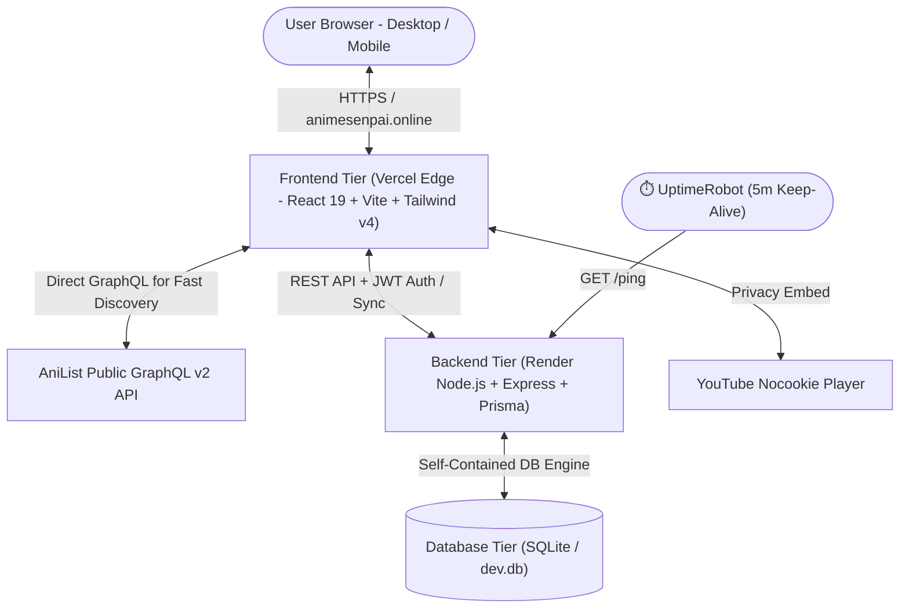

# ⚡ AnimeSenpai — Full-Stack Anime Discovery Platform

<p align="center">
  
</p>

<p align="center">
  <strong>A high-performance anime discovery, catalog search, and watchlist tracking platform connecting directly to 20,000+ anime titles via AniList GraphQL.</strong>
</p>

<p align="center">
  <a href="https://animesenpai.online" target="_blank">
    
  </a>
  <a href="https://vercel.com" target="_blank">
    
  </a>
  <a href="https://render.com" target="_blank">
    
  </a>
  <a href="https://uptimerobot.com" target="_blank">
    
  </a>
</p>

<p align="center">
  
  
  
  
  
  
  
</p>

---

## 🌐 Live Production Links

* 🌐 **Production Web Application:** [https://animesenpai.online](https://animesenpai.online)
* ⚙️ **Production Backend API:** [https://anime-watch-recommendation.onrender.com/api](https://anime-watch-recommendation.onrender.com/api)
* 🩺 **Backend Health & Ping:** [https://anime-watch-recommendation.onrender.com/ping](https://anime-watch-recommendation.onrender.com/ping)

---

## ✨ Features at a Glance

* **🎨 AniList-Inspired Clean Glassmorphic UI:** Deep navy background (`#0b1622`), slate card elevated surfaces (`#151f2e`), and vibrant electric blue accents (`#3db4f2`).
* **🔍 Real-Time Catalog Search (20,000+ Anime):** Instant autocomplete search in the upper navigation bar (`/` or `⌘K` keyboard shortcuts) with poster previews, format indicators, score pills, and genre tags.
* **🏷️ Horizontally Scrollable Category Ribbon:** Interactive preset ribbon with smooth horizontal scrolling navigation buttons (`All Anime`, `🔥 Trending`, `🌸 This Season`, `🌟 Popular`, `🏆 Top 100`, `🚀 Upcoming`, `🎬 Movies`, `📺 TV Series`, `⚡ OVA / Shorts`, and comprehensive genre filters).
* **📱 Touch & Hover Preview Popups:** Instant interactive anime preview cards displaying releasing status, season/year, studio names, format & episode counts, score smiley badges, and clickable genre pills.
* **📊 Smart Catalog Counter & Pagination:** Dynamic counter displaying `5,000+ available (from 20,000+ database)` on broad queries with informative API limit modal, and exact counts when filters are applied.
* **📋 Full Watchlist Management:** Track anime across `Watching`, `Planning`, `Completed`, `Rewatching`, `Paused`, and `Dropped` statuses with episode progress incrementing and JSON import/export.
* **🎲 Anime Randomizer "Roll" Modal:** Roll random high-rated anime based on customized genre and format selections.
* **🎬 Rich Anime Details:** High-resolution banners, synopses, characters & voice actors, related franchise anime, community recommendations, episode grids, and official YouTube trailer overlays.

---

## 🏛️ System Architecture



```
anime-watch-recommendation/
├── 📱 frontend/              # React 19 + TypeScript + Vite + Tailwind CSS v4
│   ├── src/                 # UI components, contexts, pages, hooks, styling
│   │   ├── api/             # AniList GraphQL client & Backend API service
│   │   ├── components/      # Glassmorphic UI, AnimeCard, Popovers, Navbar, Footer
│   │   ├── context/         # Watchlist & Auth state providers
│   │   └── pages/           # HomePage, DiscoverPage, AnimeDetailsPage, WatchlistPage, AuthPage
│   ├── public/              # Static assets, logos (SVG / Favicon)
│   ├── package.json         # Frontend scripts & dependencies
│   ├── vite.config.ts       # Vite bundler configuration
│   ├── vercel.json          # Vercel SPA routing configuration
│   └── .env                 # Frontend environment config (VITE_API_BASE_URL)
│
├── ⚙️ backend/               # Node.js + Express + TypeScript REST API Server
│   ├── src/
│   │   ├── config/          # Prisma DB client singleton
│   │   ├── controllers/     # Auth, Anime, Watchlist, Recommendations, Reviews
│   │   ├── middleware/      # JWT authentication, error handling, request logger
│   │   ├── routes/          # REST route handlers (/api/auth, /api/anime, /api/watchlist)
│   │   ├── services/        # AniList proxy with TTL caching & Genre affinity algorithms
│   │   └── server.ts        # Express server entry point with /ping keep-alive
│   ├── package.json         # Backend dependencies & Prisma scripts
│   ├── tsconfig.json        # Backend TypeScript configuration
│   └── .env                 # Backend environment variables
│
├── 🗄️ database/              # Database Schema, Migrations & SQLite storage
│   ├── prisma/
│   │   └── schema.prisma    # Prisma schema definition
│   ├── schema.sql           # Standard SQL DDL migration file
│   └── dev.db               # SQLite database file
│
├── render.yaml              # Render blueprint infrastructure definition
├── vercel.json              # Monorepo root Vercel configuration
├── package.json             # Root monorepo workspace & orchestration commands
└── README.md                # Main repository documentation
```

---

## ⚡ Local Development Quick Start

### Prerequisites
- **Node.js**: `v18.0+` or `v20.0+`
- **npm**: `v9.0+`

### 1. One-Step Workspace Setup
From the repository root:
```bash
npm run setup
```
*(Installs all dependencies across workspaces, generates the Prisma client, pushes the database schema, and seeds initial data).*

### 2. Start Both Frontend & Backend Concurrently
```bash
npm run dev
```
* 🌐 **Frontend Web App:** [http://localhost:5173](http://localhost:5173)
* ⚙️ **Backend REST API:** [http://localhost:5000](http://localhost:5000)
* 🩺 **API Health Check:** [http://localhost:5000/api/health](http://localhost:5000/api/health)

---

## 🛠️ Independent Tier Management

You can run and manage each layer independently:

### Frontend Tier (`/frontend`)
```bash
cd frontend
npm run dev      # Start Vite dev server with Hot Module Replacement (HMR)
npm run build    # Type-check and produce optimized production bundle
npm run preview  # Preview production build locally
```

### Backend Tier (`/backend`)
```bash
cd backend
npm run dev        # Run API server with hot-reload (tsx)
npm run build      # Compile TypeScript to JavaScript
npm run start      # Launch compiled production server
npm run db:push    # Push Prisma schema changes to SQLite (dev.db)
npm run db:studio  # Open Prisma Studio visual database browser
```

---

## 📡 API Endpoints Reference

| Module | Method | Endpoint | Description | Auth Required |
| :--- | :--- | :--- | :--- | :--- |
| **Ping** | `GET` | `/ping` | Lightweight 200 OK for UptimeRobot keep-alive | No |
| **Health** | `GET` | `/api/health` | Service uptime and status metadata | No |
| **Auth** | `POST` | `/api/auth/register` | Register new account | No |
| **Auth** | `POST` | `/api/auth/login` | Login with credentials | No |
| **Auth** | `POST` | `/api/auth/demo` | Instant demo login session | No |
| **Auth** | `GET` | `/api/auth/me` | Fetch authenticated user profile | Yes (Bearer) |
| **Anime** | `GET` | `/api/anime/trending` | Top community trending titles | No |
| **Anime** | `GET` | `/api/anime/seasonal` | Airing seasonal releases | No |
| **Anime** | `GET` | `/api/anime/top` | Top 100 highest rated anime | No |
| **Anime** | `GET` | `/api/anime/popular` | All-time most popular anime | No |
| **Anime** | `GET` | `/api/anime/search` | Multi-parameter search with filters | No |
| **Anime** | `GET` | `/api/anime/:id` | Full details, cast, streaming links, trailer | No |
| **Watchlist** | `GET` | `/api/watchlist` | Fetch user watchlist | Optional |
| **Watchlist** | `POST` | `/api/watchlist` | Add or update watchlist item | Optional |
| **Watchlist** | `PATCH`| `/api/watchlist/:id/progress` | Quick episode count increment | Optional |
| **Watchlist** | `DELETE`| `/api/watchlist/:id` | Remove item from watchlist | Optional |
| **Watchlist** | `POST` | `/api/watchlist/export` | Export watchlist JSON payload | Optional |
| **Watchlist** | `POST` | `/api/watchlist/import` | Import watchlist items | Optional |
| **Recommendations** | `GET` | `/api/recommendations/personalized` | AI/Genre-affinity recommendations | Optional |
| **Reviews** | `GET` | `/api/reviews/anime/:id` | Fetch community reviews for anime | No |
| **Reviews** | `POST` | `/api/reviews` | Post a user review and rating | Yes (Bearer) |

---

## 🔒 Security & Performance

* **Edge CDN Caching:** Lightning-fast global page loads via Vercel Edge Network.
* **In-Memory Query Caching:** Smart TTL cache prevents hitting upstream rate limits.
* **Password Hashing:** Salted `bcrypt` hashing with signed JWT authentication tokens.
* **Client-Side Resilience:** LocalStorage sync with automatic fallback ensures watchlists remain available offline.
* **Zero Tracking:** Clean, privacy-first interface without telemetry scripts.

---

## 📄 License

This project is open-source under the [MIT License](LICENSE).
