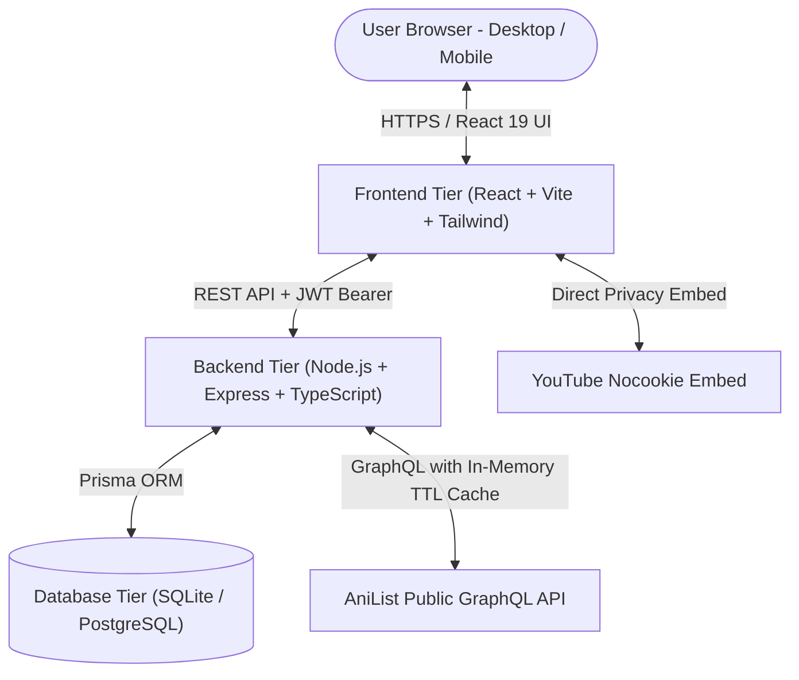

# ⚡ Voltaku — Full-Stack Anime Discovery & Recommendation Platform

<p align="center">
  
</p>

<p align="center">
  <strong>A modern, high-performance 3-tier anime discovery, real-time schedule tracking, and personalized recommendation platform.</strong>
</p>

<p align="center">
  
  
  
  
  
  
  
  
</p>

---

## 🏛️ 3-Tier System Architecture

The project is cleanly decoupled into three independent tiers:



```
anime-watch-recommendation/
├── 📱 frontend/              # React 19 + TypeScript + Vite + Tailwind CSS
│   ├── src/                 # UI components, contexts, pages, hooks, styling
│   │   ├── api/             # AniList GraphQL client & Backend API service
│   │   ├── components/      # Apple-inspired UI, Carousels, Player, Navbar
│   │   ├── context/         # Watchlist & Auth state providers
│   │   └── pages/           # Home, Discover, Anime Details, Watchlist, Auth
│   ├── public/              # Static assets, logos, SVG icons
│   ├── package.json         # Frontend scripts & dependencies
│   ├── vite.config.ts       # Vite bundler configuration
│   └── .env.example         # Environment configuration (VITE_API_BASE_URL)
│
├── ⚙️ backend/               # Node.js + Express + TypeScript REST API Server
│   ├── src/
│   │   ├── config/          # Prisma DB client singleton
│   │   ├── controllers/     # Auth, Anime, Watchlist, Recommendations, Reviews
│   │   ├── middleware/      # JWT authentication, error handling, request logger
│   │   ├── routes/          # REST route handlers (/api/auth, /api/anime, /api/watchlist)
│   │   ├── services/        # AniList proxy with TTL caching & Genre affinity algorithms
│   │   ├── scripts/         # Database seed script
│   │   └── server.ts        # Express server entry point
│   ├── package.json         # Backend dependencies & Prisma scripts
│   ├── tsconfig.json        # Backend TypeScript configuration
│   └── .env.example         # Environment variables template
│
├── 🗄️ database/              # Database Schema, Migrations, Seed Data & Docs
│   ├── prisma/
│   │   └── schema.prisma    # Prisma SQLite schema definition
│   ├── schema.sql           # Standard SQL DDL migration file
│   ├── seeds.sql            # Initial sample demo users, watchlists, & reviews
│   ├── docker-compose.yml   # Optional PostgreSQL & Redis containerization
│   └── README.md            # Schema ERD and database documentation
│
├── package.json             # Root monorepo workspace & orchestration commands
├── PRD.md                   # Product Requirements Document v2.0
└── README.md                # Main repository documentation
```

---

## ⚡ Quick Start Guide

### Prerequisites
- **Node.js**: `v18.0+` or `v20.0+`
- **npm**: `v9.0+`

### 1. One-Step Workspace Setup
From the repository root:
```bash
npm run setup
```
*(Installs all dependencies across workspaces, generates the Prisma client, pushes the SQLite schema, and seeds demo data).*

### 2. Start Both Frontend & Backend Concurrently
```bash
npm run dev
```
* 🌐 **Frontend Web App:** [http://localhost:5173](http://localhost:5173)
* ⚙️ **Backend REST API:** [http://localhost:5000](http://localhost:5000)
* 🩺 **API Health Check:** [http://localhost:5000/api/health](http://localhost:5000/api/health)

---

## 🛠️ Independent Tier Management

You can run and manage each layer independently:

### Frontend Tier (`/frontend`)
```bash
cd frontend
npm run dev      # Start Vite dev server with Hot Module Replacement (HMR)
npm run build    # Type-check and produce optimized production bundle
npm run preview  # Preview production build locally
```

### Backend Tier (`/backend`)
```bash
cd backend
npm run dev        # Run API server with hot-reload (tsx)
npm run build      # Compile TypeScript to JavaScript
npm run start      # Launch compiled production server
npm run db:push    # Push Prisma schema changes to SQLite (dev.db)
npm run db:seed    # Populate database with demo users & sample watchlists
npm run db:studio  # Open Prisma Studio visual database browser
```

### Database Tier (`/database`)
```bash
# Launch visual database GUI
npm run db:studio

# (Optional) Spin up Docker PostgreSQL & Redis containers
docker compose -f database/docker-compose.yml up -d
```

---

## 🚀 GitHub Pages Deployment

Voltaku is configured to deploy directly to **GitHub Pages** with automated GitHub Actions CI/CD!

### Option 1: Automatic Deployment with GitHub Actions (Recommended)
1. Push your changes to the `main` branch on GitHub.
2. In your GitHub repository, go to **Settings** → **Pages**.
3. Under **Build and deployment** → **Source**, select **GitHub Actions**.
4. The workflow in `.github/workflows/deploy.yml` will automatically build the frontend and deploy it to:
   ```
   https://<your-username>.github.io/anime-watch-recommendation/
   ```

### Option 2: Manual CLI Deployment
You can deploy directly to the `gh-pages` branch using the `deploy` script:
```bash
# From the root directory:
npm run deploy

# Or from the frontend directory:
cd frontend
npm run deploy
```
Then under **Settings** → **Pages**, select **Deploy from a branch** and choose `gh-pages` branch / `root`.

---

## 📡 API Endpoints Overview

| Module | Method | Endpoint | Description | Auth Required |
| :--- | :--- | :--- | :--- | :--- |
| **Health** | `GET` | `/api/health` | Service uptime and status | No |
| **Auth** | `POST` | `/api/auth/register` | Register new account | No |
| **Auth** | `POST` | `/api/auth/login` | Login with credentials | No |
| **Auth** | `POST` | `/api/auth/demo` | Instant demo login session | No |
| **Auth** | `GET` | `/api/auth/me` | Fetch authenticated user profile | Yes (Bearer) |
| **Auth** | `PUT` | `/api/auth/profile` | Update profile avatar/bio/genres | Yes (Bearer) |
| **Anime** | `GET` | `/api/anime/trending` | Top community trending titles | No |
| **Anime** | `GET` | `/api/anime/seasonal` | Airing seasonal releases | No |
| **Anime** | `GET` | `/api/anime/top` | Top 100 highest rated anime | No |
| **Anime** | `GET` | `/api/anime/popular` | All-time most popular anime | No |
| **Anime** | `GET` | `/api/anime/search` | Multi-parameter search with filters | No |
| **Anime** | `GET` | `/api/anime/:id` | Full details, cast, streaming links, trailer | No |
| **Watchlist** | `GET` | `/api/watchlist` | Fetch user watchlist | Optional |
| **Watchlist** | `POST` | `/api/watchlist` | Add or update watchlist item | Optional |
| **Watchlist** | `PATCH`| `/api/watchlist/:id/progress` | Quick episode count increment | Optional |
| **Watchlist** | `DELETE`| `/api/watchlist/:id` | Remove item from watchlist | Optional |
| **Watchlist** | `POST` | `/api/watchlist/export` | Export watchlist JSON payload | Optional |
| **Watchlist** | `POST` | `/api/watchlist/import` | Import watchlist items | Optional |
| **Recommendations** | `GET` | `/api/recommendations/personalized` | AI/Genre-affinity recommendations | Optional |
| **Recommendations** | `GET` | `/api/recommendations/anime/:id` | Similar & related franchise anime | Optional |
| **Reviews** | `GET` | `/api/reviews/anime/:animeId` | Fetch community reviews for an anime | Optional |
| **Reviews** | `POST` | `/api/reviews` | Post a community review & rating | Optional |
| **Reviews** | `POST` | `/api/reviews/:id/like` | Upvote a review | Optional |

---

## 🔒 Security & Privacy

* **Data Portability:** Full one-click JSON backup export and import.
* **Password Protection:** Salted `bcrypt` hashing with JWT authentication.
* **Intelligent Caching:** High-speed in-memory TTL caching prevents external AniList API rate limits.
* **Zero Tracking:** No invasive tracking scripts or telemetry.

---

## 📄 License

This project is open-source and available under the [MIT License](LICENSE).
