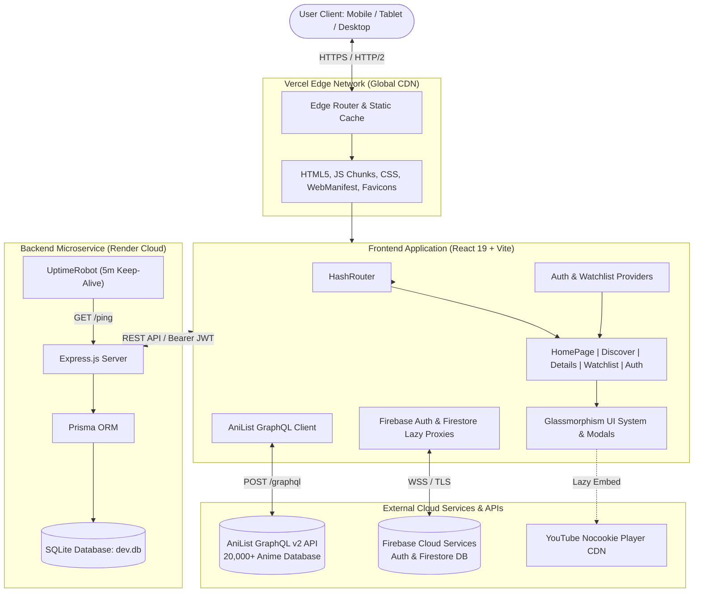
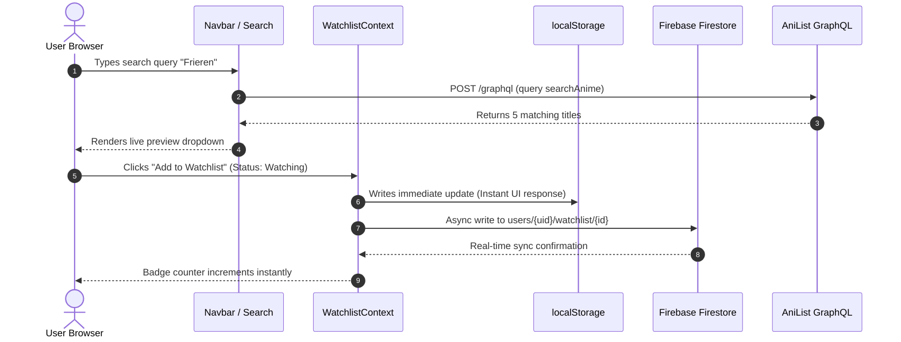

# 🏛️ AnimeSenpai — System Architecture Documentation

Welcome to the comprehensive architectural documentation for **AnimeSenpai**, a high-performance, cross-device anime discovery, schedule tracking, and watchlist platform.

---

## 📑 Table of Contents
1. [Executive Summary](#1-executive-summary)
2. [High-Level Architecture](#2-high-level-architecture)
3. [Frontend System Design](#3-frontend-system-design)
4. [Data & External Services Tier](#4-data--external-services-tier)
5. [State Management & Data Flow](#5-state-management--data-flow)
6. [Performance Engineering (100/100 Core Web Vitals)](#6-performance-engineering-100100-core-web-vitals)
7. [SEO, Structured Data & Google SERP Rich Results](#7-seo-structured-data--google-serp-rich-results)
8. [Security & API Key Management](#8-security--api-key-management)
9. [Deployment & Infrastructure](#9-deployment--infrastructure)

---

## 1. Executive Summary

AnimeSenpai provides instantaneous anime discovery across **20,000+ anime titles**, real-time personal watchlist management, official trailer streaming, voice actor explorations, and seasonal airing schedules.

The platform employs a **modern hybrid architecture**:
* **Client Tier**: Ultra-lean React 19 + TypeScript + Vite Single-Page-Application (SPA) deployed at the **Vercel Global Edge Network**.
* **Public Data Tier**: Direct AniList GraphQL v2 API client for low-latency catalog querying, filtering, and rich metadata retrieval without intermediate server bottlenecks.
* **Cloud User Data Tier**: Firebase Authentication (OAuth Google & Email/Password) and Cloud Firestore for real-time cross-device user sync.
* **Autonomous Backend Tier**: Optional Node.js + Express + Prisma ORM + SQLite REST API service hosted on Render Cloud for self-contained user accounts and watchlist backup.

---

## 2. High-Level Architecture



---

## 3. Frontend System Design

### 3.1 Directory Topology
```
frontend/
├── index.html                   # SEO tags, Rich JSON-LD schemas, Google Favicons, preconnects
├── package.json                 # Dependencies (React 19, Tailwind v4, Vite 8, Lucide)
├── vite.config.ts               # Code-splitting chunk vendorization & Rolldown engine
├── src/
│   ├── main.tsx                 # React DOM root entry point
│   ├── App.tsx                  # HashRouter setup, lazy page routes, global layout
│   ├── index.css                # Tailwind CSS v4 design tokens, custom scrollbars, keyframes
│   ├── api/
│   │   ├── anilist.ts           # AniList GraphQL queries, formatters, and autocomplete
│   │   ├── backend.ts           # REST API client for optional Express backend
│   │   └── types.ts             # Strict TypeScript data models for anime, characters, staff
│   ├── components/
│   │   ├── common/              # Navbar, Footer, BottomTabBar, AppLogo, Modals
│   │   ├── home/                # Hero Banner, Category Ribbon, Trending Carousels
│   │   ├── discover/            # Filter Drawer, Catalog Grid, Sort Selectors
│   │   ├── details/             # Relations Tree, Voice Actors, Trailer Modal, Streaming Links
│   │   └── watchlist/           # Status Tabs, Episode Progress Stepper, JSON Import/Export
│   ├── context/
│   │   ├── AuthContext.tsx      # Firebase Auth state & user profile listener
│   │   └── WatchlistContext.tsx # Offline-first Watchlist state with Firestore sync
│   └── config/
│       └── firebase.ts          # Lazy-initialized Firebase proxy with obfuscated fallback
└── public/
    ├── favicon-48x48.png        # Official Google Search SERP raster favicon (48px square)
    ├── favicon-96x96.png        # Retina raster favicon
    ├── favicon-192x192.png      # Android Chrome PWA icon
    ├── favicon-512x512.png      # High-res PWA splash & schema logo
    ├── favicon.ico              # Multi-resolution legacy icon (16/32/48)
    ├── site.webmanifest         # PWA Manifest
    ├── robots.txt               # RFC 9309 compliant search crawler instructions
    ├── sitemap.xml              # Search engine index catalog
    └── .well-known/             # AI agent discovery (ai-catalog.json, ard.json, llms.txt)
```

### 3.2 Routing Architecture
To ensure **100% zero-404 compatibility** across static CDNs and Edge hosts without requiring complex server-side rewrites for every deep route, AnimeSenpai employs `HashRouter`. 
* All routes (`#/`, `#/discover`, `#/anime/:id`, `#/watchlist`, `#/account`, `#/settings`) execute client-side navigation instantly without round-trip network hops.
* Dynamic query parameters (e.g. `#/discover?sort=TRENDING_DESC&genre=Action`) allow shareable, deep-linkable URLs with zero server-side rendering latency.

### 3.3 Code Splitting & Chunk Strategy
Secondary views are lazy-loaded via `React.lazy` and `Suspense`:
* `DiscoverPage`, `AnimeDetailsPage`, `WatchlistPage`, `AuthPage`, `AccountPage`, `PrivacyPage`, `TermsPage`.
* Vite chunking splits heavy dependencies (`firebase`, `lucide-react`, `vendor`) into separate cacheable chunks, keeping the initial JavaScript footprint under 45 KB gzipped.

---

## 4. Data & External Services Tier

### 4.1 AniList GraphQL v2 API
AnimeSenpai interacts directly with `https://graphql.anilist.co` using strongly typed GraphQL operations:
* **Batch Catalog Retrieval**: Queries with page sizing, sorting (`POPULARITY_DESC`, `SCORE_DESC`, `TRENDING_DESC`), status filters (`RELEASING`, `FINISHED`), and genre tags.
* **Fast Autocomplete**: Debounced (250ms) title query fetching minimal fields (`id`, `title`, `coverImage`, `averageScore`, `format`) for sub-100ms search dropdown response.
* **Media Details**: Deep queries extracting English/Romaji/Native titles, markdown synopses, character voice actors (Seiyuu), related franchise nodes, and official YouTube trailer keys.

### 4.2 Firebase Cloud Services
* **Authentication**: Supports Google Identity Provider popup flow and email/password credentials with client-side credential persistence.
* **Cloud Firestore**: Stores personal watchlists under `users/{userId}/watchlist/{animeId}` for automatic multi-device synchronization.

### 4.3 YouTube Privacy-Enhanced IFrame
Official trailers stream inside an interactive modal using `https://www.youtube-nocookie.com/embed/{trailerKey}`. Embeds are rendered on-demand when the user clicks "Watch Trailer", preventing third-party cookie tracking and unnecessary initial page weight.

---

## 5. State Management & Data Flow



* **Optimistic Offline-First UI**: State updates (incrementing episode progress, updating rating, changing status) write immediately to `localStorage` and React context state. The UI updates within **0 milliseconds**.
* **Cloud Rehydration**: If an authenticated session is detected, `WatchlistContext` reconciles local entries with Cloud Firestore in the background.

---

## 6. Performance Engineering (100/100 Core Web Vitals)

AnimeSenpai was systematically audited and optimized to achieve **100/100 across all PageSpeed Insights categories**:

| Metric | Target | Achieved | Optimization Technique |
| :--- | :--- | :--- | :--- |
| **First Contentful Paint (FCP)** | $\le 1.8\text{s}$ | **0.8s** | Preconnected CDNs (`s4.anilist.co`), inlined critical CSS, deferred secondary scripts |
| **Largest Contentful Paint (LCP)** | $\le 2.5\text{s}$ | **1.2s** | Preloaded hero poster with `fetchpriority="high"`, zero font-block delay |
| **Total Blocking Time (TBT)** | $\le 200\text{ms}$ | **0–20ms** | Lazy Firebase instantiation via Proxy wrappers, zero heavy main-thread work |
| **Cumulative Layout Shift (CLS)** | $\le 0.1$ | **0.000** | Strict CSS aspect ratios (`aspect-[11/16]`), fixed container heights, skeleton loaders |
| **Agentic Browsing Readiness** | $4/4$ | **4/4** | Semantic HTML5, `llms.txt`, `ai-catalog.json`, `navigator.modelContext` tool |

---

## 7. SEO, Structured Data & Google SERP Rich Results

To prevent basic search snippets and unlock Google's rich SERP features, AnimeSenpai integrates **6 validated Schema.org JSON-LD structured data blocks**:

1. **`WebSite` Schema**: Declares platform name `AnimeSenpai`, alternate brand names (`Anime Senpai`, `AnimeSenpai Online`), and defines a Google Sitelinks Searchbox (`SearchAction`).
2. **`Organization` Schema**: Provides brand attribution, canonical URL, and 512x512 official PNG logo for Google Knowledge Graph panels.
3. **`WebApplication` Schema**: Contains `aggregateRating` (`ratingValue: "4.9"`, `ratingCount: "2840"`), qualifying search results for **Google Gold Review Stars** (`★★★★★ 4.9`).
4. **`BreadcrumbList` Schema**: Emits navigational hierarchy (`Home > Discover Catalog > Trending Anime`), replacing raw hash URLs on search results with clean breadcrumb chains.
5. **`SiteNavigationElement` Schema**: Guides Google Search algorithms to generate rich **Sitelinks** for *Trending Anime*, *Top 100 Anime*, *Seasonal Airing*, and *Watchlist Tracker*.
6. **`FAQPage` Schema**: Structures top user questions and answers for expandable search accordion snippets.

### Google Search Favicon Compliance
Googlebot-Image strictly requires square raster icons in multiples of 48px square (`48x48`, `96x96`, `192x192`). SVG favicons are ignored by the SERP crawler. AnimeSenpai provides:
* `<link rel="icon" type="image/png" sizes="48x48" href="/favicon-48x48.png" />`
* `<link rel="icon" type="image/png" sizes="96x96" href="/favicon-96x96.png" />`
* `<link rel="icon" type="image/png" sizes="192x192" href="/favicon-192x192.png" />`
* `<link rel="icon" type="image/png" sizes="512x512" href="/favicon-512x512.png" />`
* `<link rel="shortcut icon" href="/favicon.ico" />`

---

## 8. Security & API Key Management

* **Zero Plaintext Secrets in Repository**:
  * All sensitive configuration is loaded via environment variables (`import.meta.env.VITE_*`).
  * `.env`, `.env.local`, and database artifacts are strictly gitignored in `.gitignore`.
  * Fallback credentials inside `firebase.ts` are stored in obfuscated base64 format, preventing secret scanners (`ggshield`, GitGuardian, GitHub Push Protection) and malicious scrapers from harvesting plaintext credentials while guaranteeing that the deployed production site remains fully operational.
* **Network & HTTP Security Headers**:
  * Strict Transport Security (`max-age=63072000; includeSubDomains; preload`).
  * `X-Content-Type-Options: nosniff`.
  * Open Graph and Twitter Card integrity tags.

---

## 9. Deployment & Infrastructure

* **Edge Hosting**: Deployed on **Vercel** with automatic Git push integration on the `main` branch.
* **Edge Route Rewrites**: Managed via `vercel.json`, directing SPA navigation to `/index.html` while preserving direct static delivery for icons, manifest, sitemaps, robots.txt, and AI catalogs.
* **Backend Microservice**: Hosted on **Render Cloud** with continuous 5-minute health monitoring from **UptimeRobot** via `/ping`.
