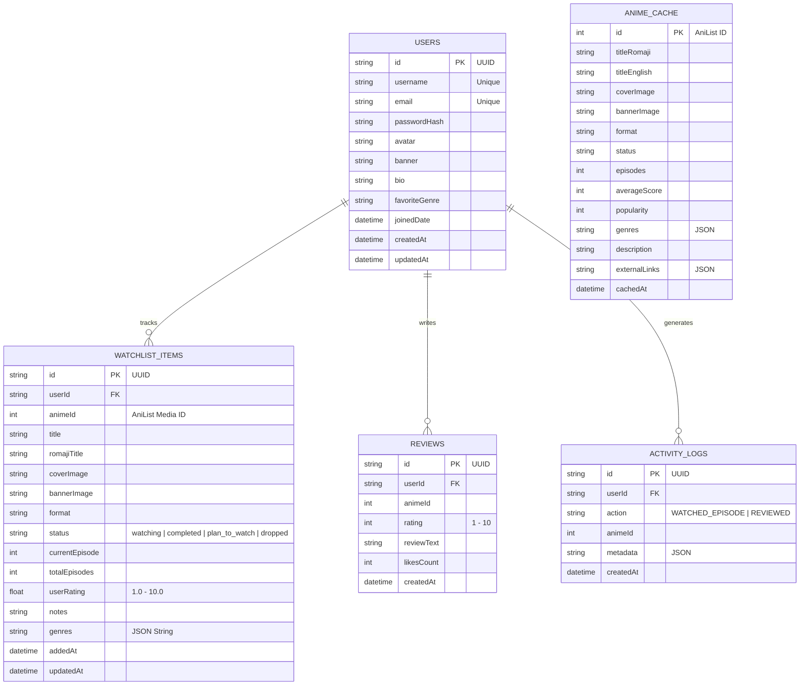

# Voltaku — Database Layer

This directory contains the database definitions, Prisma ORM schema, SQL DDL migrations, initial seed datasets, and optional Docker orchestration.

---

## 🗄️ Database Architecture

The default setup uses **SQLite** (embedded, zero-configuration local database stored at `backend/prisma/dev.db` or `database/dev.db`), powered by **Prisma ORM**.

It is also fully compatible with **PostgreSQL** by updating `provider = "postgresql"` in `prisma/schema.prisma` and running the included `docker-compose.yml`.

### Entity-Relationship Diagram (ERD)



---

## 📁 Directory Structure

```
database/
├── prisma/
│   └── schema.prisma      # Prisma schema definitions (SQLite / PostgreSQL)
├── schema.sql             # Standard SQL DDL migration script
├── seeds.sql              # Initial demo users, watchlists, & reviews
├── docker-compose.yml     # Optional PostgreSQL & Redis container setup
└── README.md              # Database documentation (this file)
```

---

## 🚀 Quick Database Commands

From the project root or backend folder:

```bash
# Push schema to SQLite database
npx prisma db push --schema=../database/prisma/schema.prisma

# Launch visual Prisma Studio database manager
npx prisma studio --schema=../database/prisma/schema.prisma

# (Optional) Spin up Docker PostgreSQL & Redis
docker compose -f database/docker-compose.yml up -d
```
